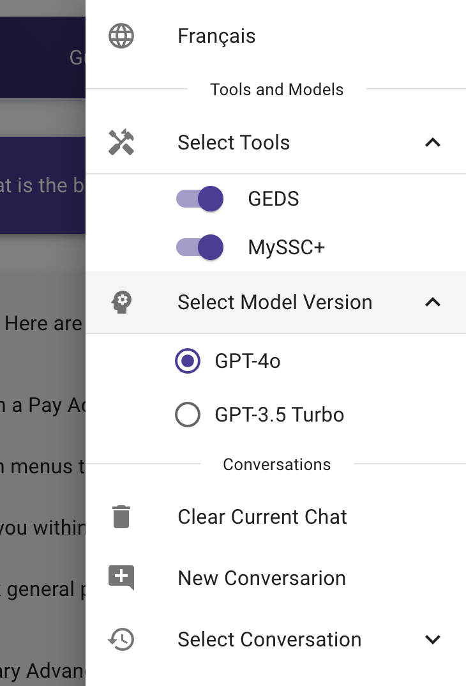
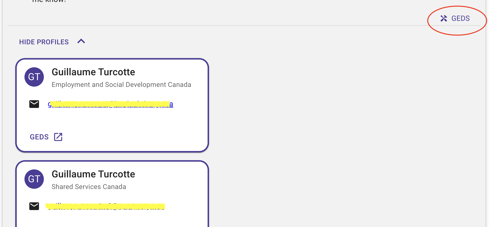
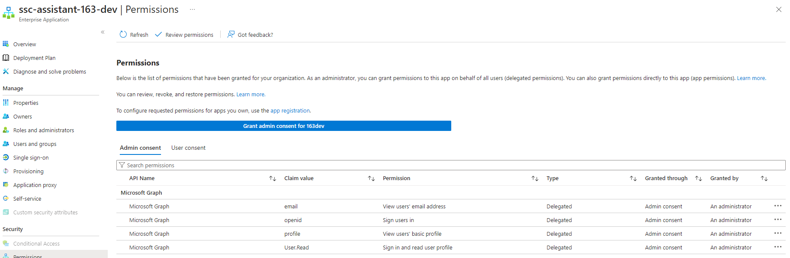

# SSC Assistant
Second iteration of the SSC chatbot/assistant.


The SSC Assistant leverages the **Azure OpenAI** API to utilize advanced language models such as **GPT-4o**. It employs the Retrieval Augmented Generation (RAG) method, integrating external APIs and tools to offer a wide array of options for users.



When the Assistant uses a tool in its API call, it indicates which tools were used in the response and displays the relevant metadata. For example, here is how it presents information retrieved using the GEDS tool:



## Developer(s)

This section will help developer understand this project and how to set it up from the ground up and how to run it on their machine.

### Codespaces

Simply create your branch and create a codespace for it from github. Load up that codespace you will have everything that you need to start working,

### or Dev Containers (recommended)

Here is how you can develop locally with Dev Containers.

#### Pre-requisites

* VSCode with Dev Container extension
* Docker engine installed on Linux (Can be via WSL 2.0 on Windows)
> **NOTE:** If you are using Docker Desktop you are **required** to have an Enterprise lisence.

#### Steps

`Ctrl + Shift + P` in VSCode and then `Dev Containers: Reopen in Container` (or alternatively if you never did open it `Dev Containers: Open Folder in Container...` and select the repo with `ssc-assistant`).

> **NOTE:** [Sharing SSH Key with the container via `ssh-agent`](https://code.visualstudio.com/remote/advancedcontainers/sharing-git-credentials)

### Development steps:

Development steps are the same once you are inside the container (regardless if spun from Codespaces or locally from Dev Containers extension):

`Ctrl + Shift + ~` to open 2 new terminals and simply start the services: 

> NOTE: It is important that you firsts login via `az login  --use-device-code`

API: 

`cd app/api && flask run --debug --port=5001`

Frontend: 

`cd app/frontend && npm run dev`

All the necessary `npm install` and `pip install` commands have already been run and you can simply reach the codespace url that points to the `8080` port.

**NOTE**: You will need to have a `163dev` account in order to develop and test on DEV/locally ([request an account](https://forms.office.com/pages/responsepage.aspx?id=lMFb0L-U1kquLh2w8uOPXgYMhvp43QhHmpexXCVOi0NUNzZSUjJZSjRDNldYWUpPWDVIWkdZMzZJMi4u)).

### Issues with Dev Container Workspace Cache

If you encounter an issue starting `npm` in dev containers you can refer to this [workaround/bug](https://stackoverflow.com/questions/75708866/vscode-dev-container-fails-to-load-ms-vscode-js-debug-extension-correctly).

### Manual setup API

We are developing on python 3.12+.

 * [Install UV](https://github.com/astral-sh/uv)
 * Install Python 3.12, (or via `uv python install 3.12`)
 * Create `virtualenv`, `cd app/api` and then `uv venv`
 * `source .venv/bin/activate`
 * `uv pip sync requirements-dev.txt` (install dependencies)

**Now ensure that VSCode** uses the proper `.venv` folder by pressing `Ctrl + Shift + P` and then type `Python: Select Interpreter`

### Manual Setup Frontend

 * [Install nvm/npm/node](https://nodejs.org/en/download/)

### Infrastructure

The current infrastructure of this project is as follow:

* Azure Sandbox Subscription
    * Azure Function to transform the raw data (SSCPlus, etc.) to a Search Service index

* Service dependencie(s)
    * SSCPlus Data Fetch services (loads up raw data into blobs)
    * Azure OpenAI Services

#### Spinning up the infrastructure

Prerequisites:

* Azure Client, minimum of `Contributor` role in the subscription, then simply `az login`
* terraform

```bash
cd terraform/
terraform init
terraform plan -var-file="secret.tfvars"
```

### 163dev Account Permissions

To sign into a Microsoft account during development, a @163dev.onmicrosoft.com account must be used.

The following permisions must be granted to the account through Azure:



## Documentation

* [SSC Assistant API](http://127.0.0.1:5001/docs)
* [Azure Search Services](https://learn.microsoft.com/en-us/azure/search/search-get-started-portal)
* [Use your data](https://learn.microsoft.com/en-us/azure/ai-services/openai/concepts/use-your-data?tabs=ai-search)