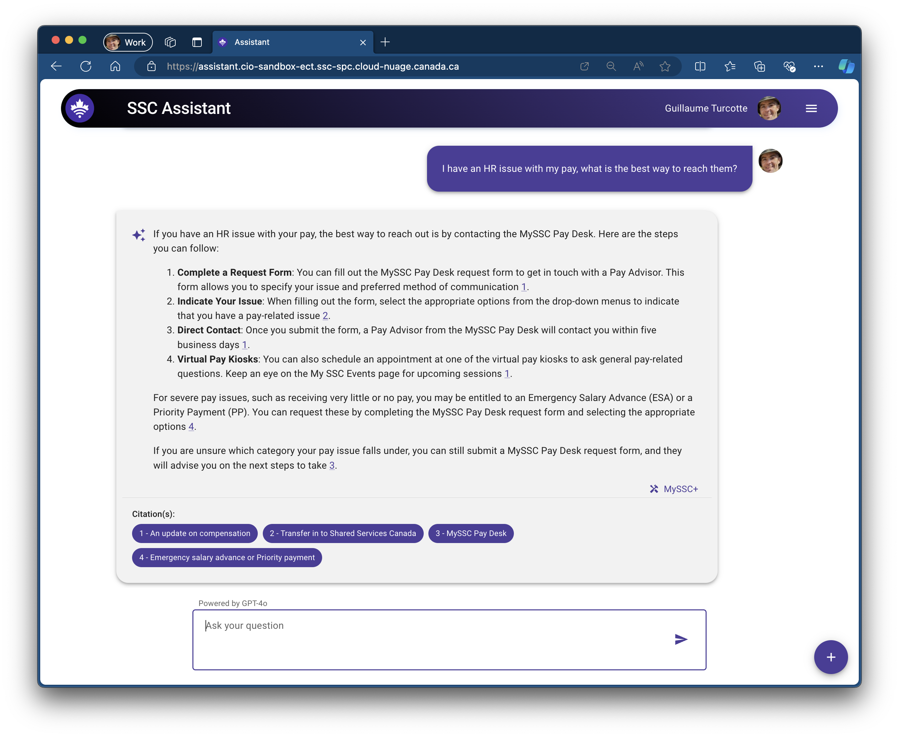

# SSC Assistant
Second iteration of the SSC chatbot/assistant.



The SSC Assistant leverages the **Azure OpenAI** API to utilize advanced language models such as **GPT-4o**. It employs the Retrieval Augmented Generation (RAG) method, integrating external APIs and tools to offer a wide array of options for users.


When the Assistant uses a tool in its API call, it indicates which tools were used in the response and displays the relevant metadata. For example, here is how it presents information retrieved using the GEDS tool:


## Developer(s)

This section will help developer understand this project and how to set it up from the ground up and how to run it on their machine.

### Codespaces

Simply create your branch and create a codespace for it from github. Load up that codespace you will have everything that you need to start working,

`Ctrl + Shift + ~` to open 2 new terminals and simply start the services: 

> NOTE: It is important that you firsts login via `az login --device-code`

API: 

`cd app/api && flask run --debug --port=5001`

Frontend: 

`cd app/frontend && npm run dev`

All the necessary `npm install` and `pip install` commands have already been run and you can simply reach the codespace url that points to the `8080` port.

**NOTE**: You will need to have a `163dev` account in order to develop and test on DEV/locally ([request an account](https://forms.office.com/pages/responsepage.aspx?id=lMFb0L-U1kquLh2w8uOPXgYMhvp43QhHmpexXCVOi0NUNzZSUjJZSjRDNldYWUpPWDVIWkdZMzZJMi4u)).

### Dev Containers (recommended)

Here is how you can develop locally with Dev Containers.

#### Pre-requisites

* VSCode with Dev Container extension
* Docker engine installed on Linux (Can be via WSL 2.0 on Windows)
  * **NOTE:** If you are using Docker Desktop you are **required** to have an Enterprise lisence.

#### Steps

`Ctrl + Shift + P` in VSCode and then `Dev Containers: Reopen in Container` (or alternatively if you never did open it `Dev Containers: Open Folder in Container...` and select the repo with `ssc-assistant`).

### Manual setup (deprecated)

We are developing on python 3.11+.

Please setup your environement like so:

We have 2 python projects in this repo, I create 2 virtual envs and switch between them via command line and/or visual studio.

First we setup the backend API project:

```bash
python3 -m venv .venv_api
source .venv_api/bin/activate
pip install -r app/api/requirements.txt --upgrade
```

You should then see something like this denoting which environement you are in your shell. To leave this `.venv` simply type `deactivate`

```bash
(.venv_api) ➜  ~/git/ssc-assistant/
```

**Now ensure that VSCode** uses the proper `.venv` folder by pressing `Ctrl + Shift + P` and then type `Python: Select Interpreter`

and then the azure function project:

```bash
python3 -m venv .venv_func
source .venv_func/bin/activate
pip install -r az-functions/create-index/requirements.txt --upgrade
```

(for this virtual env the `.vscode/settings.json` should already be pointing to the proper folder, else re-follow steps above to ensure VSCode uses the proper venv for that section of the project)

#### Starting up projects

For the `app/frontend` simply:

```bash
npm install
npm run dev
```

### Infrastructure

The current infrastructure of this project is as follow:

* Azure Sandbox Subscription
    * Azure Function to transform the raw data (SSCPlus, etc.) to a Search Service index

* Service dependencie(s)
    * SSCPlus Data Fetch services (loads up raw data into blobs)
    * Azure OpenAI Services

#### Spinning up the infrastructure

Prerequisites:

* Azure Client, minimum of `Contributor` role in the subscription, then simply `az login`
* terraform

```bash
cd terraform/
terraform init
terraform plan -var-file="secret.tfvars"
```

### 163dev Account Permissions

To sign into a Microsoft account during development, a @163dev.onmicrosoft.com account must be used.

The following permisions must be granted to the account through Azure:


## Documentation

* [Azure Search Services](https://learn.microsoft.com/en-us/azure/search/search-get-started-portal)
* [Use your data](https://learn.microsoft.com/en-us/azure/ai-services/openai/concepts/use-your-data?tabs=ai-search)
