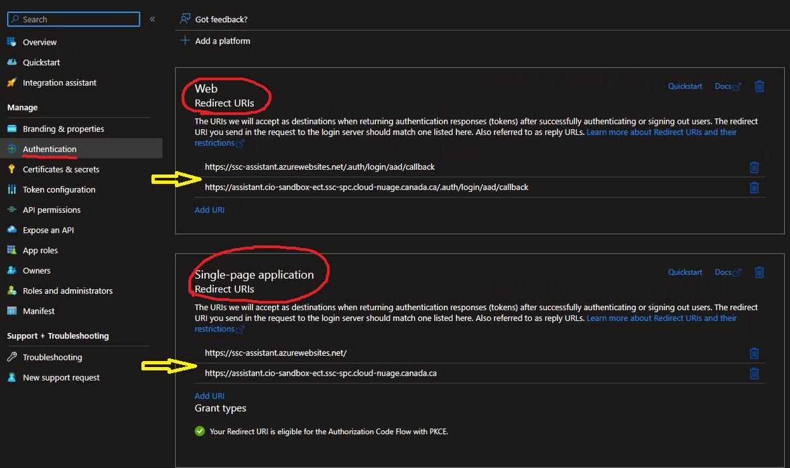

# React + TypeScript + Vite

This template provides a minimal setup to get React working in Vite with HMR and some ESLint rules.

Currently, two official plugins are available:

- [@vitejs/plugin-react](https://github.com/vitejs/vite-plugin-react/blob/main/packages/plugin-react/README.md) uses [Babel](https://babeljs.io/) for Fast Refresh
- [@vitejs/plugin-react-swc](https://github.com/vitejs/vite-plugin-react-swc) uses [SWC](https://swc.rs/) for Fast Refresh

## Expanding the ESLint configuration

If you are developing a production application, we recommend updating the configuration to enable type aware lint rules:

- Configure the top-level `parserOptions` property like this:

```js
export default {
  // other rules...
  parserOptions: {
    ecmaVersion: 'latest',
    sourceType: 'module',
    project: ['./tsconfig.json', './tsconfig.node.json'],
    tsconfigRootDir: __dirname,
  },
}
```

- Replace `plugin:@typescript-eslint/recommended` to `plugin:@typescript-eslint/recommended-type-checked` or `plugin:@typescript-eslint/strict-type-checked`
- Optionally add `plugin:@typescript-eslint/stylistic-type-checked`
- Install [eslint-plugin-react](https://github.com/jsx-eslint/eslint-plugin-react) and add `plugin:react/recommended` & `plugin:react/jsx-runtime` to the `extends` list

## Developpers

The following `.env` settings are there to control certain components from being made available to the end-user: 

```bash
VITE_ALLOWED_TOOLS=geds,corporate,archibus,pmcoe,telecom
VITE_DISABLED_FEATURES="file_upload"
```

* `VITE_ALLOWED_TOOLS`: This controls the tools that will be presented in the tools menu, example, the BITS (EDR) data,
geds API And so on.
* `VITE_DISABLED_FEATURES`: disables the listed features. For instance `file_upload` will disable the file upload button
from the UI.

**NOTE**: Important note here those values are controlled by the [github frontend.yml workflow](../../.github/workflows/frontend.yml)

## Documentation

- [Based on MUI](https://mui.com/material-ui/all-components/)

### MSAL Authentication

- [app registration setup](https://learn.microsoft.com/en-us/entra/identity-platform/scenario-spa-app-registration)
- [demo with Azure AD CIAM](https://learn.microsoft.com/en-us/samples/azure-samples/ms-identity-ciam-javascript-tutorial/ms-identity-ciam-javascript-tutorial-1-sign-in-react/)
- [react msal App reg setup](https://learn.microsoft.com/en-us/entra/identity-platform/tutorial-single-page-app-react-register-app)
- [react msal app config](https://learn.microsoft.com/en-us/entra/identity-platform/tutorial-single-page-app-react-prepare-spa?tabs=visual-studio)

### Keycloak Authentication (optional)

Set `VITE_AUTH_PROVIDER=keycloak` in [app/frontend/.env](.env), then provide:
- `VITE_KEYCLOAK_URL`
- `VITE_KEYCLOAK_REALM`
- `VITE_KEYCLOAK_CLIENT_ID`

The frontend will use Keycloak instead of MSAL to obtain the access token.

Note: Keycloak mode currently targets the playground UI; the main MSAL-based app remains unchanged.

### Setting up custom SSL/TSL certs and bindings in Azure App Services

General documentation on the subject: 

* [Import cert in app service](https://learn.microsoft.com/en-us/azure/app-service/configure-ssl-certificate?tabs=apex#import-an-app-service-certificate)
* [Secure a custom DNS name with a TLS/SSL binding in Azure App Service](https://learn.microsoft.com/en-us/azure/app-service/configure-ssl-certificate?tabs=apex#private-certificate-requirements)

#### Requesting a new certificate

Altought you could directly go via the Azure services to purschase a cert and greatly simplify things, we needed a `canada.ca` certificate
and chose to go via our `SSC Enterprise Service Desk - SPC Bureau de Service d'Entreprise` service desk to request (either a Entrust or ICM cert).

1. Create your private key and generate a certificate request for the domain you require `something.blah.canada.ca`. 
  * I normally do this via `openssl` in linux but this can also be done in Windows via `Win+R` `certlm.msc` (as administrator).
2. When you receive your certificate we will chain the intermediate with the root and the server certificate in 1 big `.pem/.cer` file as base64.

```bash
~/certs/ssc-assistant unzip ssc-assistant.entrust.zip
Archive:  ssc-assistant.entrust.zip
  inflating: ServerCertificate.crt
  inflating: Root.crt
  inflating: Intermediate.crt
```
and then `cat ServerCertificate.crt <(echo) Intermediate.crt <(echo) Root.crt > ssc-assistant-chain.crt`

3. (optional) if you need to extract your private key out of your `.pfx` (depending on how it's currently stored) you can run the following command:
  * `openssl pkcs12 -in privatekey.pfx -nocerts -out privatekey.pem -nodes`
  * **IMPORTANT**: Do NOT leave that private key out there not password protected or stored securely
4. Bundle certificate(s) along with private key into 1 `.pfx` ready to be used by our services.
 * First concatenate all the certificate your received into 1 file `<merged-certificate-file>` and [then do this](https://learn.microsoft.com/en-us/azure/app-service/configure-ssl-certificate?tabs=apex#export-merged-private-certificate-to-pfx);
 * `openssl pkcs12 -keypbe PBE-SHA1-3DES -certpbe PBE-SHA1-3DES -macalg SHA1 -export -out myserver.pfx -inkey <private-key-file> -in <merged-certificate-file>`

#### Required configuration for Application registration

Depending on how you setup the security on the application you might need to setup the Web Redirect URI(s) or Single Page Application (SPA) Redirect URI(s) *or both*:



##### Modifying App Reg

In Powershell: 

```powershell
Connect-AzureAD
$sp = Get-AzureADServicePrincipal -Filter "displayName eq 'SSC-Assistant-Dev'"
$assistant_dev_grp = Get-AzureADGroup -SearchString "SEC SSC-Assistant-Dev Enterprise App Users"
$appId = $sp.AppId
$app = Get-AzureADApplication -Filter "AppId eq '$appId'"
$newRedirectUri = "http://localhost:8080/"
$appReplyUrls = $app.ReplyUrls
$appReplyUrls.Add($newRedirectUri)
Set-AzureADApplication -ObjectId $app.ObjectId -ReplyUrls $appReplyUrls
```