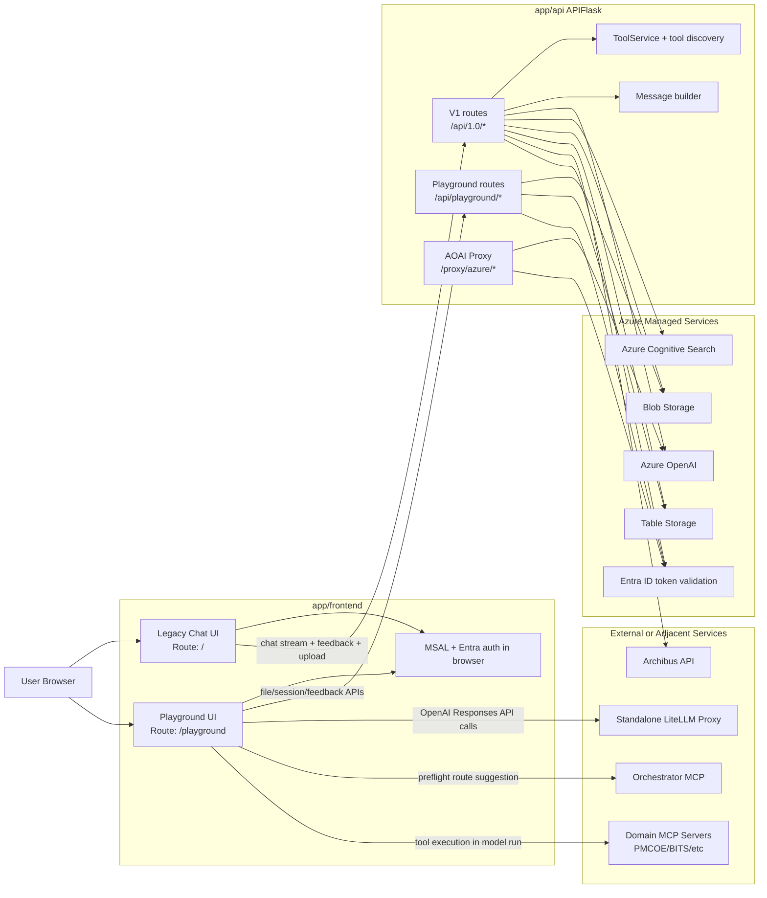
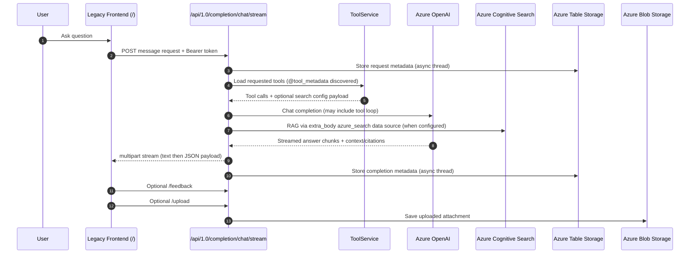
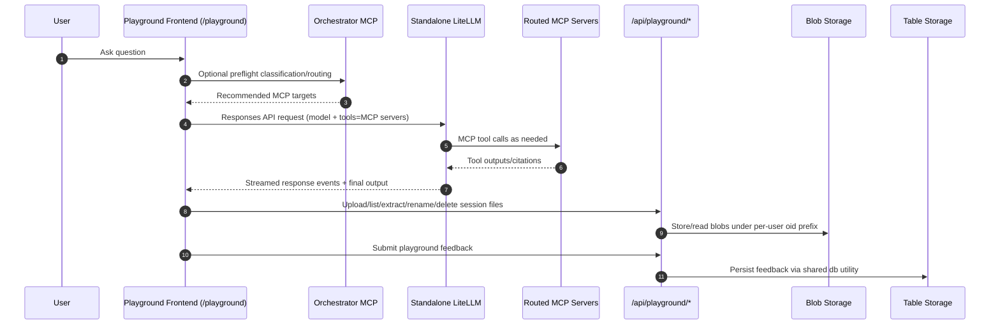

# SSC Assistant Architecture Overview (Onboarding)

Last updated: 2026-08-04

This document explains, at a high level, how the current SSC Assistant architecture works, including:

- The legacy system (main chat path)
- The newer Playground system
- Shared dependencies (Azure services, storage, auth)
- External integrations (LiteLLM, MCP servers, Archibus)

It is based on current code paths, not only README descriptions.

## 1) System Context (Old + New)

## 2) Legacy Flow (Current Production-Like Path)

Notes:

- Legacy frontend chat calls `/api/1.0/completion/chat/stream` and parses the multipart boundary `GPT-Interaction`.
- Tool responses can alter retrieval configuration by returning an `AzureCognitiveSearchDataSourceConfig` shape.
- Legacy telemetry persistence is primarily Azure Table Storage (`chat`, `feedback`, `flagged`, `suggest`).

## 3) Playground Flow (New System)

Notes:

- Playground completion path is currently frontend -> standalone LiteLLM directly.
- Playground API routes are used for file/session lifecycle and feedback, not for chat generation.
- Orchestrator and downstream MCP selection are controlled by client config (`VITE_MCP_SERVERS`) and preflight logic.

## 4) How Old and New Systems Are "Fused"

Both systems coexist in one repo and one frontend app:

- Same web app, different routes:
  - Legacy UI at `/`
  - Playground UI at `/playground` (feature-flag controlled)
- Same backend process (`app/api/app.py`) hosts:
  - Legacy v1 API routes
  - Playground file/session routes
  - AOAI proxy routes (`/proxy/azure/*`)
- Shared auth model:
  - Entra access token validation (`Authorization: Bearer`)
  - API key role checks where configured (`X-API-Key`)
- Shared storage/utilities:
  - Blob and Table helpers are reused across old/new endpoints.

## 5) External Service Interactions to Account For

These are the major service boundaries for architecture discussions:

- Azure OpenAI (legacy chat, plus optional AOAI proxy path)
- Azure Cognitive Search (legacy RAG retrieval)
- Azure Blob Storage (legacy uploads and playground file/session artifacts)
- Azure Table Storage (chat logs, suggestions, feedback, flags)
- Standalone LiteLLM proxy (playground completion runtime)
- MCP servers (orchestrator + domain servers used by playground)
- Archibus API (legacy booking workflow)

## 6) Current Gaps / Drift to Be Aware Of

Observed architecture drift:

- `app/api/README.md` describes embedded LiteLLM endpoints (`/proxy/litellm/*`),
 but current `app/api/proxy` code exports only Azure proxy routes (`/proxy/azure/*`).
- Frontend playground README and provider code indicate standalone LiteLLM usage.

This likely means LiteLLM strategy has shifted and docs need consolidation.

## 7) Practical File Map (Where To Start Reading)

- Backend entrypoint: `app/api/app.py`
- Legacy chat routes: `app/api/v1/routes_v1.py`
- Legacy AOAI + RAG logic: `app/api/utils/openai.py`
- Tool discovery/execution: `app/api/src/service/tool_service.py`
- Playground backend routes: `app/api/playground/routes_playground.py`
- AOAI proxy route: `app/api/proxy/azure.py`
- Frontend route split: `app/frontend/src/routes/AppRoutes.tsx`
- Legacy chat API client: `app/frontend/src/api/api.ts`
- Playground provider (LiteLLM): `app/frontend/src/playground/services/providers/azureOpenAIProvider.ts`
- Orchestrator integration: `app/frontend/src/playground/services/orchestratorService.ts`

## 8) Suggested Follow-up (Onboarding FAQ Draft)

Next, we can build a developer onboarding FAQ around questions like:

1. Which path should I extend: legacy (`/api/1.0`) or playground?
2. Where is the real source of truth for model routing now: AOAI proxy or LiteLLM?
3. How are MCP servers configured and safely validated?
4. Where are citations produced, transformed, and displayed in each path?
5. How does auth differ between frontend, API, and MCP hops?
6. What data is persisted, where, and under which retention model?
7. What is the migration target: keep both systems or converge on one?
