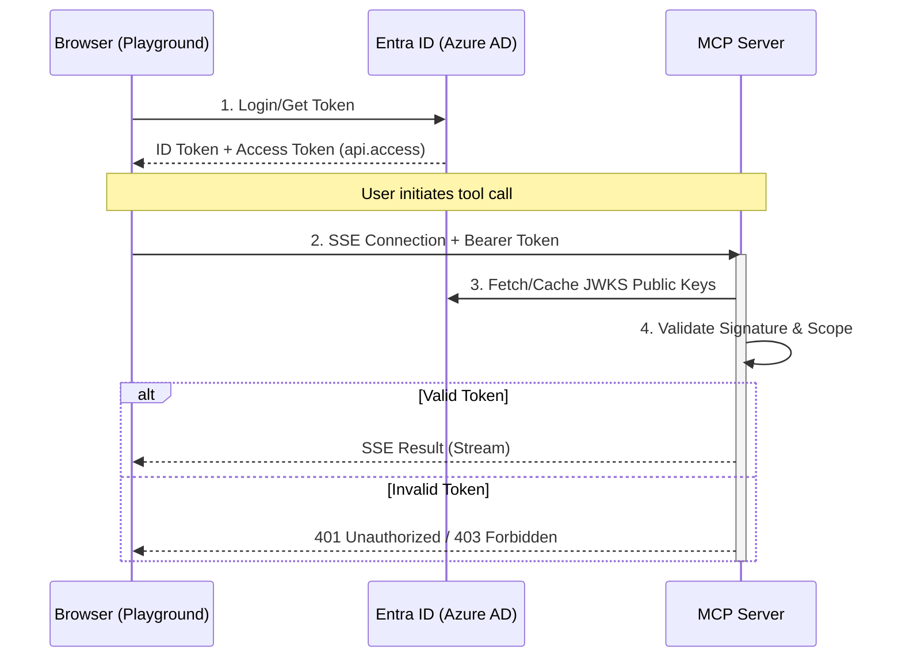

# Secure MCP Servers for SSC Assistant

This directory contains shared utilities to secure Model Context Protocol (MCP) servers using the same Microsoft Entra ID (Azure AD) authentication as the SSC Assistant Playground.

## Overview

The security architecture ensures that MCP servers are not "publicly open" but are instead part of the same security boundary as the main API.

### How it works

1.  **Unified Authentication**: The user logs into the SSC Assistant application via MSAL.
2.  **Token Attachment**: When the Playground sends a request to an MCP server (e.g., to list tools or call a function), it automatically attaches the user's current `accessToken` to the `Authorization: Bearer <token>` header.
3.  **Server-Side Validation**: The MCP server uses the shared `MSALAuthMiddleware` to:
    *   Fetch the latest public RSA keys from Microsoft.
    *   Verify the token signature, issuer, and expiry.
    *   Validate that the token has the `api.access` scope (consistent with the main API).
4.  **CORS & Preflights**: Since the Playground calls MCP servers directly from the browser, the boilerplate handles the necessary Cross-Origin Resource Sharing (CORS) headers and `OPTIONS` requests.

---

## Getting Started

### 1. Requirements

Your MCP server environment needs the following Python packages:
```bash
pip install pyjwt cryptography starlette mcp uvicorn python-dotenv
```

### 2. Environment Configuration

The MCP server expects the same environment variables configuration as the `app/api` folder. You can copy these from your main `.env` file:

| Variable | Description |
| :--- | :--- |
| `AZURE_AD_TENANT_ID` | Your Microsoft Entra ID Tenant ID. |
| `AZURE_AD_CLIENT_ID` | The Client ID of the API registration. |
| `API_SCOPE` | Defaults to `api.access`. |
| `SKIP_USER_VALIDATION` | Set to `True` for local development to bypass security checks. |

---

## How to Implement a Secure MCP Server

The easiest way to implement security is to use the provided boilerplate utility. This wraps the standard MCP SSE app with the security and CORS middleware.

### Create your server (`main.py`)

```python
from mcp.server.fastmcp import FastMCP
from common.mcp_boilerplate import create_secure_mcp_app
import uvicorn
from dotenv import load_dotenv

# Load env vars for auth
load_dotenv()

# Define your MCP server
mcp = FastMCP("Secure Information Tool")

@mcp.tool()
def fetch_info(topic: str) -> str:
    """A sample tool that requires authentication to use."""
    return f"Authenticated result for: {topic}"

if __name__ == "__main__":
    # create_secure_mcp_app adds:
    # 1. CORS Middleware (for browser access)
    # 2. MSAL Auth Middleware (token validation)
    # 3. OPTIONS pre-flight handling
    app = create_secure_mcp_app(mcp)
    
    # Run the server
    uvicorn.run(app, host="0.0.0.0", port=8000)
```

---

## Usage by Other Systems

While these servers are secured for the Playground, they can still be used by other tools or automated systems.

### 1. Local Development & Debugging (Claude Desktop, Cursor, etc.)
If you want to use the MCP server locally with tools that do not support MSAL authentication:
1. Set `SKIP_USER_VALIDATION=True` in your local environment.
2. This will disable the token check, allowing any local client to connect to the server (SSE or Stdio).

### 2. Automated / System-to-System Access
If another automated system needs to call these tools:
1. **Acquire a Token**: The calling system must authenticate with Azure AD using a **Client Credentials Flow** (App Registration with a Client Secret).
2. **Permissions**: The calling app must be granted the `api.access` App Role (defined in the main API's manifest).
3. **Authorization Header**: The calling system must include the token in the request:
   `Authorization: Bearer <system-access-token>`

---

## Technical Flow Diagram



## Directory Structure

- `common/auth.py`: Shared Starlette middleware for JWT validation.
- `common/mcp_boilerplate.py`: Helper to wrap FastMCP applications with standard security.
- `README.md`: This documentation.
